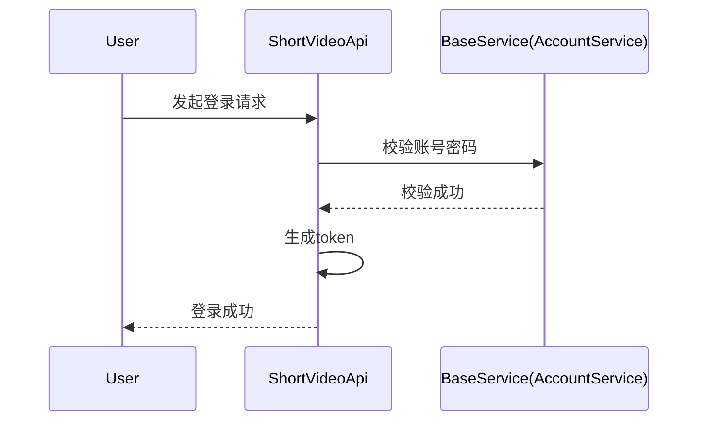

# 登录

```mermaid
sequenceDiagram
    participant U as User
    participant api as ShortVideoApi
    participant a as BaseService(AccountService)

    U->>api: 发起登录请求
    
    api->>a: 校验账号密码
    a-->>api: 校验成功

    api->>api: 生成token
    api-->>U: 登录成功
```
