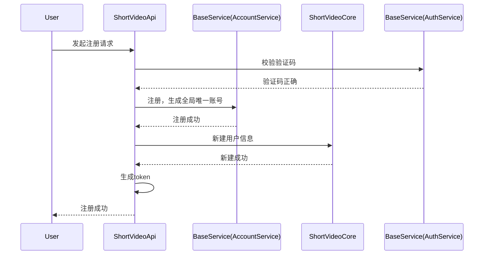

# 注册

```mermaid
sequenceDiagram
    participant U as User
    participant api as ShortVideoApi
    participant a as BaseService(AccountService)
    participant c as ShortVideoCore
    participant s as BaseService(AuthService)

    U->>api: 发起注册请求
    
    api->>s: 校验验证码
    s-->>api: 验证码正确

    api->>a: 注册，生成全局唯一账号
    a-->>api: 注册成功

    api->>c: 新建用户信息
    c-->>api: 新建成功

    api->>api: 生成token
    api-->>U: 注册成功
```
