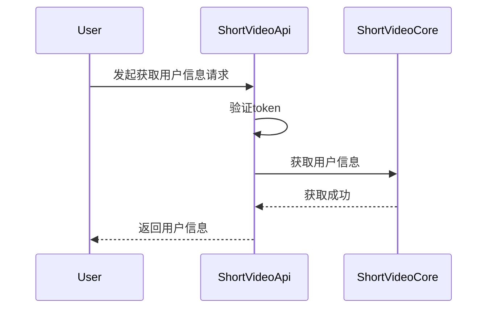

# 获取用户信息

```mermaid
sequenceDiagram
    participant U as User
    participant api as ShortVideoApi
    participant c as ShortVideoCore

    U->>api: 发起获取用户信息请求
    api->>api: 验证token
    api->>c: 获取用户信息
    c-->>api: 获取成功
    api-->>U: 返回用户信息
```
